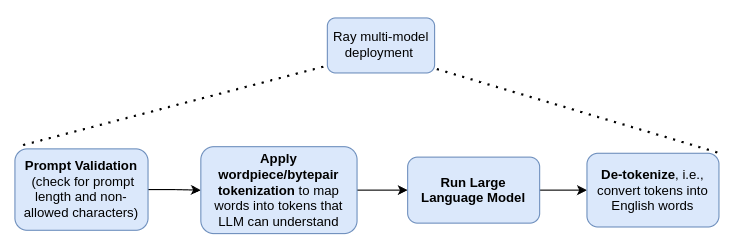
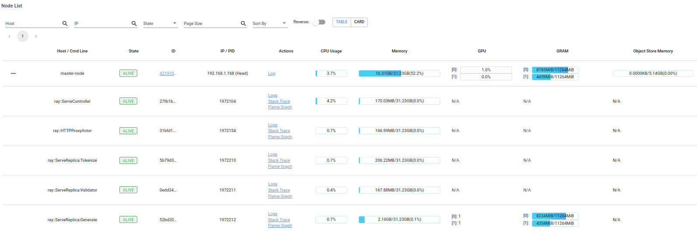
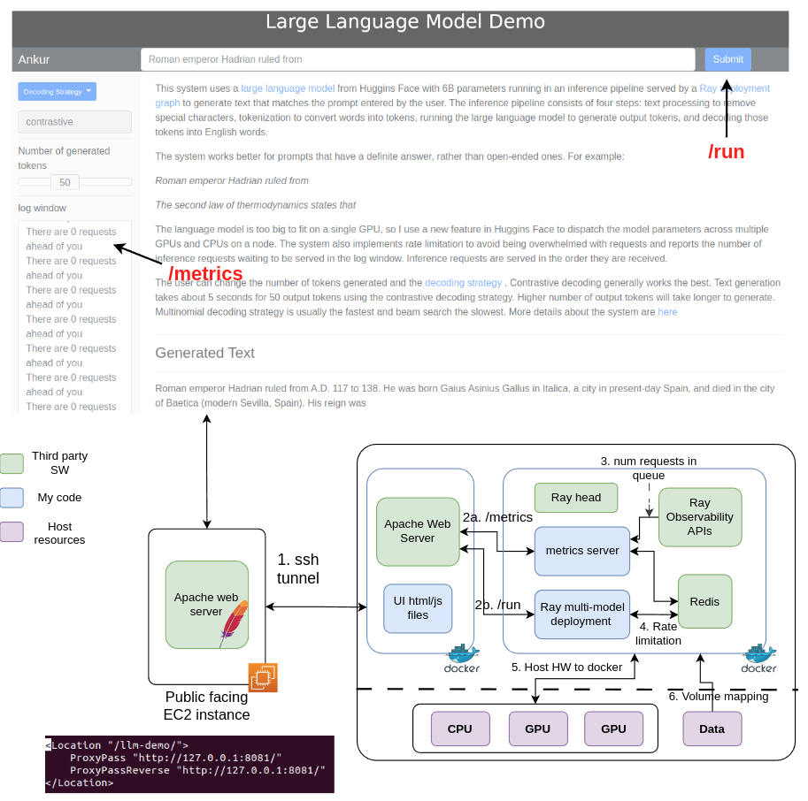

# Introduction
This project demonstrates using Ray serve to deploy a large language model inference pipeline. It also demonstrates setting rate limits on each deployment in the pipeline and using Ray observability APIs to report the number of requests waiting to be served.
 
 The inference pipeline applies the following steps to a user prompt: 
 1. text processing to remove special characters ($, * etc) from the prompt and apply constraints on minimum/maximum number of characters in the prompt
 2. Tokenization to convert words into tokens from the vocabulary of the large language model
 3. Running the [large language model](https://huggingface.co/sgugger/sharded-gpt-j-6B) on the tokens to generate new tokens using the decoding scheme specified by the user
 4. Decoding the output tokens into English words



These four steps are implemented using three models - *validator* [src\validator.py], *tokenizer* [src\tokenizer.py] and *generator* [src\generator.py]. Each of these models is a Ray deployment which are composed together into a [deployment pipeline](https://docs.ray.io/en/latest/serve/model_composition.html#serve-model-composition). This pipeline is exposed as a rest endpoint via Ray Serve.

The entrypoint to the deployment is the *Run* method in *Generate* deployment. This method is exposed at *ray_serve_address/run* and applies the 4 steps listed above in sequence. 

The system can be deployed on-prem or on the cloud, on an individual workstation or on a compute cluster, given sufficient system resources to load and run inference on the large language model. I've only tested the system on my personal computer running Ubuntu 20.04, equipped with 20 cores, 32 GB RAM and 2 1080 Ti GPUs. Each GPU has about 11GB of usable RAM. At ~16GB, the language model is too big to fit on a single GPU, so I use a [new feature](https://huggingface.co/docs/accelerate/usage_guides/big_modeling) in Huggins Face to dispatch the model parameters across available devices (such as multiple GPUs and CPUs). Using this technique, inference can happen even if the model is too big to fit on one of the GPUs or the CPU RAM! Huggins Face inference library distributes the model layers across available devices (respecting any user-specified constraints) and takes care of transferring the input to a layer to the appropriate device. 

In this deployment pipeline, the processing time is dominated by the Generate deployment. Assume that each generate request takes 5 sec, and the other steps in the pipeline take 0.5 sec. If the expected number of requests per sec is 2 and desired max latency for serving each request is 6 sec, then we'd need two replicas of the Generate deployment and a single replica of the other deployments for the pipeline throughput to meet the latency SLA. 

Ray automatically takes care of scaling in/out deployment replicas in a deployment pipeline. The user can specify the min and max number of replicas for each deployment, as well as the number of ongoing requests for each replica (*target_num_ongoing_requests_per_replica*) as the autoscaling metric. If the number of requests waiting to be processed exceeds this number, the Ray autoscaler will spawn new replicas upto the max number of replicas specified by the user and given sufficient compute/memory resources on the cluster to accomodate these replicas. Conversely, if the request volume is low, replicas will be removed until the number of requests waiting to be processed starts approaching the autoscaling target.

In the example above, the desired latency bound can be achieved by setting *target_num_ongoing_requests_per_replica* = 1. As incoming requests pile up, the Ray autoscaler will spawn another replica of the Generate deployment.

Because my computer only has 2 GPUs, and both GPUs are utilized to store model parameters and run inference, only one replica of the Generate deployment can be deployed at a time. This means that the system can only serve a single request at a time. This limitation arises from the lack of compute resources on my computer, and not because of a limitation in Ray.

## Rate Limitation
 Rate limiting is commonly used to improve the availability of API-based services by avoiding resource starvation. It helps maintain system availability by preventing excessive use--whether intended or unintended. 
 For microservices built using FastAPI, [Fastapi-limiter](https://github.com/long2ice/fastapi-limiter) is a popular package to add route specific rate limits. 
 
 Using Fastapi-limiter requires hooking into the startup event of the FastAPI app, as shown below
 ```sql
@app.on_event("startup")
async def startup():
    redis = redis.from_url("redis://localhost", encoding="utf-8", decode_responses=True)
    await FastAPILimiter.init(redis)

```
This requires manually creating the FastAPI app object, rather than relying on Serve to do so internally. Fortunately, Serve provides a more explicit [integration with FastAPI](https://docs.ray.io/en/latest/serve/http-guide.html), allowing you to define a Serve deployment using the @serve.ingress decorator that wraps a FastAPI app with its full range of features. A Serve deployment can be created like this:
```python
@serve.deployment(ray_actor_options={"num_cpus": 1, "num_gpus": 2.0},  autoscaling_config={
        "min_replicas": 1,
        "initial_replicas": 1,
        "max_replicas": 5,
        "target_num_ongoing_requests_per_replica": 10,
    })
@serve.ingress(app)
class Generate:
    @app.post("/run", dependencies=[Depends(RateLimiter(times=10, seconds=60))])
    async def run(self, request: Request) -> JSONResponse:
        print("processing request")
        # Run inference
``` 
Note that FastAPI rate limiter requires a redis server to be running. By default, Redis listens on port 6379, which also happens to be the port Ray's GCS listens on. To avoid conflict, redis-server must be instructed to use a different port. This can be done like this:
```python
redis-server --port 6380
```

## Reporting number of requests in queue to the user
On my system, a text generation request takes ~5 sec to complete. Because of hardware resource limitations on my system, only a single request can be processed at a time (because both available GPUs are being utilized to run inference). This means that concurrent requests will be queued up and processed sequentially. To provide users an estimate of how long it will take to process their request, it is desirable to report the number of requests waiting to be processed, which is a good proxy for expected response time. 

I use Ray observability APIs to obtain a summary of tasks. I then filter this list of tasks by "handle_request" tasks that are in the "RUNNING" state. My experiments revealed this to be a good proxy for requests waiting to be served. There could be a more direct way to obtain this information as well. The code for this is in metrics.py

```python
@app.get("/metrics", dependencies=[Depends(RateLimiter(times=500, seconds=10))])
def metrics() -> JSONResponse:
    num_pending_requests = 0
    try:  # raise_on_missing_output flag prevents throwing an exception when the returned data is too large and
        # when the returned data is too large
        tasks = summarize_tasks(raise_on_missing_output=False)
    except Exception as e:
        print(e)
    else:
        summary = tasks["cluster"]["summary"]

        for k, v in summary.items():
            if "handle_request" in k:
                if v['state_counts'].get('RUNNING'):
                    num_pending_requests += v['state_counts']['RUNNING']
    finally:
        return JSONResponse(num_pending_requests)
```
As Ray continues running, the number of tasks in the system continues to increase. Thus, retrieving and filtering Ray tasks using the logic above gets progressively slower. To avoid this slowdown, Ray can be instructed to only keep a record of a certain number of tasks, and discard information about other tasks. This is done at Ray startup time using the `RAY_task_events_max_num_task_in_gcs` parameter
```python
RAY_task_events_max_num_task_in_gcs=500 ray start --head --dashboard-host=0.0.0.0 &
```

## System deployment
 I've tested this system on my personal computer equipped with 20 cores, 32GB RAM and 2 1080 Ti GPUs. Each GPU has about 11GB of usable RAM. The system may not deploy if your workstation lacks sufficient HW resources. One good way to verify this is to try performing inference on the [sharded-gpt-j-6B](https://huggingface.co/sgugger/sharded-gpt-j-6B/tree/main) model outside of Ray. You may also try using a smaller model that your HW can support. 

The generate text  deployment uses the [sharded-gpt-j-6B](https://huggingface.co/sgugger/sharded-gpt-j-6B/tree/main). You should download the model files and place it somewhere on your computer. The directory containing the model files is provided to the deployment as an environment variable. This environment variable is specified as a [runtime_env](https://docs.ray.io/en/latest/ray-core/handling-dependencies.html#id1) in the runtime_env.yaml file. You should update this file with the directory where you place the model. 
### Without docker
1. Clone this repo
2. Install python dependencies in your conda environment (see requirements.txt). 
3. Start redis server on port 6380
    ```python
    redis-server --port 6380 
    ```
4. Download the sharded-gpt-j-6B model and update the runtime_env.yaml file 
5. Deploy the generate deployment using Ray serve CLI
    ```python
    cd src
    serve run generate:generate --runtime-env ../runtime_env.yaml
    ```
### Using docker
Note that building a docker image with Ray, GPU support and Pytorch takes a lot of disk space. If you don't have sufficient disk space in your root partition but have unused partitions on your workstation, you could mount a new directory on that partition and bind mount your /var/lib/docker to this directory. See [this](https://www.ibm.com/docs/en/cloud-private/3.1.1?topic=pyci-specifying-default-docker-storage-directory-by-using-bind-mount) for instructions
1.   Install GPU support for docker. Follow instructions [here](https://docs.nvidia.com/datacenter/cloud-native/container-toolkit/install-guide.html)
2. Clone this repo
3. Build the application docker image. You can name the image to whatever you'd like
    ```python
    docker build -t ray2.3_llm .
    ```
4. Run a container based on this image
```python
docker run --name llm_demo \
-p 0.0.0.0:8000:8000 # address of the serve deployment \
-p 0.0.0.0:8265:8265 # Ray dashboard address \
-p 0.0.0.0:8001:8001 # address of the metrics server \
-it --gpus all # make all system GPUs available to the docker container \
-v /path/to/sharded-gpt-j-6B:/home/ray/app/models:ro # volume map the host directory where the model is located to a path inside the docker container. This avoids copying the model data into the image \
--rm  # will remove the container upon exit \
ray2.3_llm /bin/bash /home/ray/app/src/startup_script.sh 
```
startup_script.sh does the following:
* Starts redis server on port 6380, because port 6379 is used by Ray's GCS
* Starts Ray head node
* Starts the metrics server (port 8001)
* Starts the generate deployment (port 8000)

#### Testing the deployment
1. Verify the Tokenize, Validator and Generate deployment are running using the Ray dashboard

2. Send a curl request to the serve endpoint (localhost:8000 by default)
    ```python
    curl -X POST 127.0.0.1:8000/run -H "Content-Type: application/json" -d '{"data": "Roman emperor Trajan ruled from", "num_tokens": 50, "decoding_strategy": "multinomial"}'
    ```
    You should receive back a valid response. The [decoding_strategy](https://huggingface.co/docs/transformers/generation_strategies#contrastive-search) can be "contrastive", "multinomial sampling" or "beam search". The default is "contrastive". The default for number of tokens is 50. 
3. [OPTIONAL] You can test the metrics server using the following curl command
    ```python
    curl -X GET 127.0.0.1:8001/metrics
    ```
   You'll receive back a number indicating the number of requests waiting in the queue to be served

You can also run the *test_client.py* test script. This script sends a number of POST requests to the ray serve deployment and records the time when each request is sent and response received, along with the response status code and content. The rate limitation for the *run* method on the *generate* deployment is set to 10 requests every 60 seconds. The script sends 15 requests in 20 seconds, so the last 5 requests will receive a 429 response code. The timeout is set by default to 30 seconds, and because the system can only process 1 request at a time due to HW limitations, some requests will timeout, with a 408 response code.

## System Architecture

